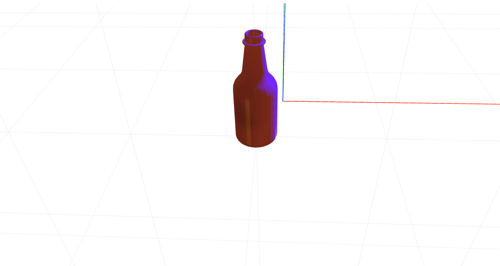

# craft-bottle

# Install
`$ npm install craft-bottle`

# Parameters
```sh
resolution - determines how many sides the bottle will have.
height - decides how tall the bottle is.
```

# Example
```html
<craft>
	<craft name="bottle" module="craft-bottle"/>
	<bottle></bottle>
</craft>
```

